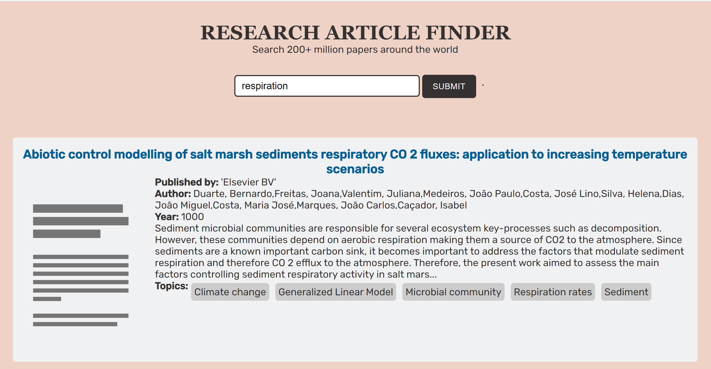

### General info
Search and download open access research papers from around the world.

The API used is the <a href="https://core.ac.uk/services/api/">CORE API</a> - a free API providing real-time machine access to metadata and full texts of research papers. It is organised by resource type. The resources are articles, journals and repositories and are represented using JSON data format. It searches through all articles and returns a JSON array with search results.

### To view
Link to the project: https://juel07.github.io/research-article-finder/

### Screenshot

### Tech
- HTML
- CSS
- JavaScript
- API
